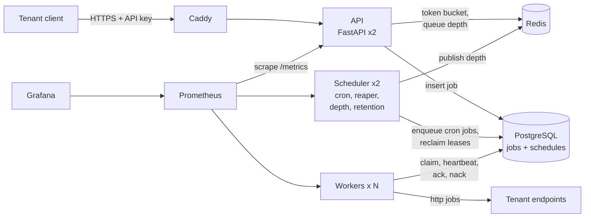
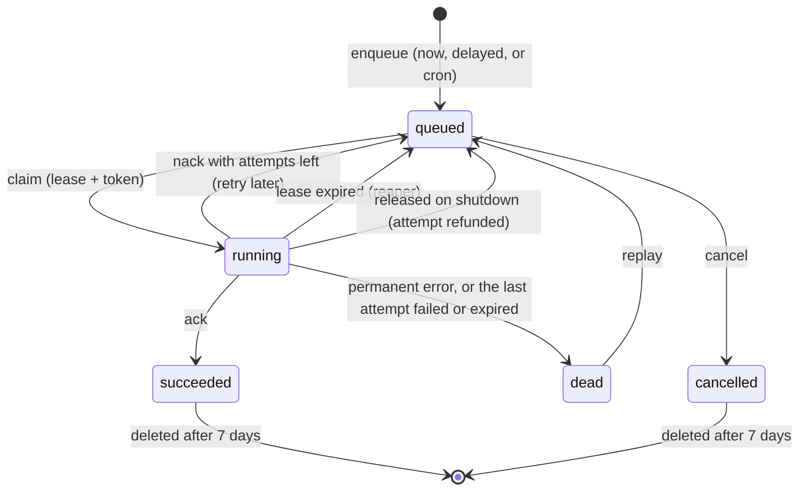

# Hopper design

Hopper is a job queue that many tenants share. A tenant sends a job over HTTP. Hopper runs it at least once,
retries it with backoff if it fails, parks it in a dead-letter queue if it keeps failing, and lets the tenant
replay it. Jobs can run now, after a delay, at a set time, or on a cron schedule.

This document explains how it works and why it is built this way. Every number in it was measured; the raw data is
linked from [benchmarks.md](benchmarks.md). Short records of each decision are in [adr/](adr/).

## 1. Problem, goals and non-goals

**The problem.** Services need to do work outside a web request: send a webhook, resize an image, run a nightly
report. That work must not be lost when a machine crashes, must not run forever when it keeps failing, and one
noisy customer must not slow everyone else down.

**Goals**

- Never lose an accepted job, even when workers are killed in the middle of running it.
- Retry failures with backoff; move jobs that keep failing to a dead-letter queue (DLQ) that can be replayed.
- Run jobs now, later, or on a cron schedule, with two schedulers and no double firing.
- Keep tenants apart: one tenant can never see another's jobs, and each is rate-limited.
- Show what is happening: metrics, a dashboard, alerts.
- Deploy every merge automatically, and roll back a bad release without a person.

**Non-goals**

- **Exactly-once delivery.** No queue can promise it when workers crash (section 3). Hopper gives at-least-once
  delivery and helps handlers be idempotent.
- **More than one region, or more than one Postgres.** One database is the source of truth.
- **High availability of the host.** It is one EC2 instance. If the instance dies, Hopper is down until it is
  replaced.
- **Fair scheduling between tenants.** Rate limits and queue quotas cap what each tenant sends in, but workers
  pick jobs by priority and time, not by tenant (section 8).

## 2. Architecture

**PostgreSQL is the queue and the source of truth.** A job is a row in the `jobs` table. Every change to a job is
one SQL statement, so a job is never half-updated. **Redis holds only rate-limit buckets and a cached queue depth.**
If Redis is lost, no job is lost (ADR-0001).

Every process keeps no state of its own, and runs one per container:

| Process | Does | How many |
|---|---|---|
| API | checks the API key and rate limit, writes the job row, answers | 2 replicas behind Caddy |
| Worker | claims jobs, runs them, heartbeats, acks or nacks | 3 (any number: `--scale worker=N`) |
| Scheduler | fires cron schedules, reclaims expired leases, counts queue depth, deletes old jobs | 2 |

### The life of a job

1. The API checks the key, the tenant's rate limit and the queue depth, then inserts a row with
   `status = 'queued'` and `run_at` (now, or later).
2. A worker **claims** it. In one short transaction it picks ready rows with `FOR UPDATE SKIP LOCKED`, sets them to
   `running`, and gives each a **lease** (30 s) and a new **lease token**.
3. While the handler runs, the worker renews the lease every 10 s (**heartbeat**).
4. When the handler finishes, the worker **acks** (`succeeded`). If it fails, the worker **nacks**: the job goes
   back to `queued` with a later `run_at` (a retry), or to `dead` (the DLQ).
5. If the worker dies, nobody renews the lease. The **reaper** sees it expire and puts the job back in the queue.

### Job states

A delayed job is just a `queued` row whose `run_at` is in the future; the claim query skips it until then. A dead
job is a row with `status = 'dead'`, not a row in another table, so it keeps its id and history (ADR-0005).

### Why `SKIP LOCKED`

Many workers ask for jobs at the same time. With a normal `SELECT ... FOR UPDATE`, the second worker would wait
for the first one's lock on the same rows. With `SKIP LOCKED`, it skips the locked rows and takes the next ones, so
every worker gets a different batch without waiting. The lock lasts only for the claim transaction (milliseconds);
after that, the lease protects the job. A test runs 10 claimers over 1,000 jobs and checks every job was claimed
exactly once. In the load test there were 0 lock waits, even with 8 workers draining 2,773 jobs/s.

## 3. Delivery semantics: at-least-once

What happens when a worker crashes depends on one thing: **when the job is marked done, relative to running it.**

| Ack timing | Crash after the ack, before the work | Crash after the work, before the ack | Guarantee |
|---|---|---|---|
| Ack before running | job never runs: **lost** | cannot happen | at-most-once |
| Ack after running | cannot happen | job runs again: **duplicate** | at-least-once |

A worker cannot tell "slow" from "dead" across a network. So no queue can promise **exactly-once** delivery when
workers crash. What a system can build is **effectively once**: at-least-once delivery plus idempotent handlers.

**Hopper acks after running.** A lost payment webhook is worse than a duplicate that carries a dedup key.

**The proof.** The chaos test (`chaos/kill_workers.py`) enqueues 10,000 jobs and kills a random worker every 3 to
10 s for 5 minutes. It also freezes one worker past its lease, sends one SIGTERM and restarts Redis.

| Run | Workers killed | Lost | Duplicate runs |
|---|---|---|---|
| EC2 server, ack after running | 38 | **0** | 9 |
| Laptop, ack after running | 36 | **0** | 8 |
| Laptop, ack **before** running (negative control) | 33 | **69** | 0 |

The negative control matters. A test that can never fail proves nothing. Switching the same workers to
"ack before running" loses 69 jobs, and the checks catch every one. So when the normal run says 0, it means it.

### Leases and fencing tokens

A worker that only *paused* (a long garbage-collection pause, a frozen VM) is dangerous. Its lease expires, the job
runs on another worker, and then the first worker wakes up and tries to write its result.

Every claim gets a new random `lease_token`, and every write for that run (heartbeat, ack, nack, release) has
`WHERE lease_token = :token`. When the paused worker wakes up, its token is old, so its ack updates **0 rows**.
The job's state can never be overwritten by a stale run. In the EC2 chaos run, 1 late ack was refused this way.

The lease numbers are a trade-off (ADR-0003):

| Setting | Value | Why |
|---|---|---|
| Lease | 30 s | survives two missed heartbeats |
| Heartbeat | every 10 s, one statement per worker for all its jobs | 8 workers × 20 jobs cost under 1 statement/s |
| Reaper | every 5 s | worst-case recovery is about 35 s |

Measured: a killed job finished on another worker in a median of 32 s (31.7 s on EC2), and at most 60 to 65 s,
when the job then had to wait for a free worker while others were being killed too.

**Graceful shutdown.** On SIGTERM (every deploy), a worker stops claiming, gives running jobs 25 s to finish, then
**releases** the rest back to the queue without using up an attempt. Deploys never push a job into the DLQ.

## 4. Idempotency: why workers must be idempotent

At-least-once means a job can run more than once. These are the concrete ways it happens in Hopper:

1. **A worker crashes after the side effect, before the ack.** The reaper requeues the job; it runs again.
2. **A worker pauses past its lease.** The job runs on another worker. The fencing token blocks the stale ack in
   `jobs`, but not a side effect the first worker already made, such as an email it sent.
3. **An `http` job times out on Hopper's side** after the tenant's server already did the work.
4. **A DLQ replay** reruns a job that had partly succeeded before it died.
5. **A client retries an enqueue** without an `Idempotency-Key`, which creates a second job.

So handlers must be **idempotent**: running one twice must have the same effect as running it once. Ways to do
that, each with a Hopper example:

| Technique | Hopper example |
|---|---|
| Pass the job id downstream as an idempotency key | the `http` task sends `Idempotency-Key: <job id>` on every call |
| A unique constraint or upsert | the chaos test's `effect` task: `INSERT ... ON CONFLICT (job_id) DO NOTHING` |
| A conditional update | every queue write in Hopper: `UPDATE jobs ... WHERE lease_token = :token` |
| Set a value instead of adding to it | `status = 'succeeded'` is safe to repeat; `count = count + 1` is not |
| The outbox pattern | when the effect lives in the same database as the job's own data |

On the client side, `Idempotency-Key` on `POST /v1/jobs` stops case 5. The same key and body return the original
job (200, `Idempotent-Replayed: true`); the same key with a different body is a client bug (422). 50 concurrent
requests with one key create exactly one job (ADR-0006).

The chaos test shows this works: 9 duplicate runs on EC2, but every job's effect happened **exactly once**.

## 5. Scaling: what breaks first at 10x

The load test ran on a laptop (i7-13700H) with the same stack as production: 2 API replicas, each one Python
process. It ran each scenario 3 times and reports the median ([benchmarks.md](benchmarks.md)).

| Scenario | Result |
|---|---|
| A. Enqueue | 400 req/s comfortably; the API tops out at about 545 req/s |
| B. Drain 100,000 jobs | 956 jobs/s with 1 worker, 2,773 jobs/s with 8 |
| C. 300 jobs/s for 10 min | API p95 20 ms, enqueue to done p95 254 ms, 0 errors |
| D. Step up to failure | 400 req/s held in all 3 runs; at 500 the API accepted only 463 to 491 |

### Predicted order versus measured

The build guide predicted Postgres write load would break first. **It was the API.**

| Order | What breaks | Evidence | Fix |
|---|---|---|---|
| 1 (measured) | **API CPU** | at 500 req/s both API processes were at 100% of a core each, while Postgres used under one core and the queue wait stayed under 0.3 s | add API replicas, which is easy because the API keeps no state; uvloop and httptools (Week 8) make each one cheaper |
| 2 (predicted) | **Postgres CPU and writes** | each job is about 5 writes (insert, claim, ack, attempt row, heartbeats). Postgres used 3.2 cores while 8 workers drained, and dead tuples on `jobs` reached about 97,000 | batch claims and acks; tune autovacuum further; partition finished jobs by day and drop old partitions |
| 3 (predicted) | **Connections** | 60 of 100 with 8 workers (pool of 5 per process) | PgBouncer in transaction mode |
| 4 (predicted) | **Empty polling** | idle workers poll every 250 to 500 ms each | `LISTEN/NOTIFY` wake-ups |
| 5 (predicted) | **Claim contention** | 0 lock waits so far, but many workers compete for the head of one queue | bigger claim batches; split hot queues |
| 6 (predicted) | **Depth counting** | `count(*)` once a second over the queued rows | planner estimates or incremental counters |

**Redis is not close to breaking.** It does one small Lua call per request, and a single Redis can typically do
tens of thousands of those a second.

**At 10x** (about 5,000 enqueues/s): the API needs about 10 replicas, which means more than one host. Postgres
would then be the limit, and the steps above (batching, partitioning, PgBouncer) come next. Past that, the hot path
would move to a log built for it (Kafka, or Redis Streams) with Postgres keeping job state. That brings back the
dual-write problem that ADR-0001 avoided, so it would need the outbox pattern.

## 6. Failure modes

| Component down | What happens | Jobs lost? |
|---|---|---|
| **One worker** | its jobs come back after the lease expires (about 35 s) and run on another worker | No (chaos test: 38 kills, 0 lost) |
| **All workers** | jobs wait in the queue. `NoWorkers` alerts after 1 minute. At the depth limits, enqueues get 429 or 503 | No |
| **One scheduler** | the other one does everything; both take rows with `SKIP LOCKED` | No |
| **Both schedulers** | cron stops, crashed jobs are not reclaimed, and after 15 s the depth limits switch off. `NoScheduler` alerts | No; recovery resumes when one comes back |
| **Redis** | rate limits fall back to buckets inside each API process; the API keeps its last depth counts. `/readyz` says `degraded` (200) | No (chaos test restarts Redis) |
| **Postgres** | the API answers **503** `database_unavailable` with `Retry-After: 5`; `/readyz` fails, so Caddy stops sending traffic. Workers retry their claim every 0.5 s. Leases may expire meanwhile, so some jobs run again | No committed job |
| **One API replica** | Caddy's 2 s `/readyz` probe takes it out of rotation; the other replica serves | No |
| **A bad release** | the health check and smoke test fail, and `deploy.sh` puts the old release back by itself: caught at 42 s, serving again at 79 s on EC2 | No |
| **The EC2 host** | everything is down until the instance is back. Data lives on its disk (EBS), so a restart keeps it | Only if the disk is lost too: backups are not automated yet |

## 7. Security

| Area | How |
|---|---|
| **API keys** | `hop_live_<prefix>_<secret>` with 32 random bytes. Only the prefix and `HMAC-SHA256(pepper, secret)` are stored; the pepper is an environment secret, never in the database. Compared in constant time (ADR-0010) |
| **Admins** | password (Argon2id) → a 15-minute HS256 JWT with `iss` and `aud`. `alg: none` and other algorithms are rejected. Logins are rate-limited per email |
| **Tenant isolation** | the tenant comes only from the API key, and every query has `tenant_id` in its `WHERE`. Another tenant's job answers 404, not 403, so ids never leak. A test calls every route with tenant B's key against tenant A's data; another test fails if a new route is added without being checked |
| **SSRF** (the `http` task) | Hopper resolves the URL's host, refuses private, loopback, link-local (169.254.169.254), and other internal addresses, including when hidden inside IPv6 forms such as NAT64. It then connects to the exact address it checked, so DNS cannot change the answer in between. No redirects |
| **Webhook signing** | each `http` call carries `Hopper-Signature: t=<time>,v1=HMAC-SHA256(tenant secret, "t.body")`, so the tenant can check it came from Hopper and is not a replay |
| **Abuse limits** | rate limit per tenant (429), queue quotas (429, 503), request bodies over 256 KB refused (413) |
| **Secrets** | in `/opt/hopper/.env` on the host (mode 600), never in the image or the repository. Services refuse to start without them |
| **The server** | only Caddy has public ports; Postgres, Redis, Prometheus and metrics are internal. SSH takes keys only. The CI deploy key can only run `deploy.sh` with one word. Grafana is view-only without a login |

**Known gap: the live server uses plain HTTP**, because it has no domain name yet. API keys sent to it cross the
internet unencrypted. Caddy turns on HTTPS by itself once `SITE_ADDRESS` is set to a domain
([deploy.md](deploy.md)). Until then, use only throwaway demo keys on it.

## 8. Limitations and future work

Stated plainly:

- **One host, no high availability.** Next: managed Postgres with backups (RDS), and the API and workers on ECS or
  several hosts. Backups are not automated yet; `pg_dump` to S3 is the first step.
- **No fairness between tenants.** A tenant with a huge backlog delays other tenants' jobs in the same queue.
  Rate limits and quotas cap intake but not claiming. Fix: per-tenant in-flight caps, or round-robin claiming.
- **Workers poll.** Idle workers still query every 250 to 500 ms. Fix: `LISTEN/NOTIFY`.
- **About 35 s to recover a crashed worker's job.** Shorter leases recover faster but cost more heartbeats and risk
  false expiries (ADR-0003).
- **A revoked API key works for up to 60 s** on other API replicas, because of the key cache (ADR-0010).
- **Rate limits double during a Redis outage** with two API replicas, because each falls back to its own bucket
  (ADR-0008).
- **Plain HTTP on the live server** until it has a domain (section 7).
- **The load test ran on a laptop**, with the load generator on the same machine. The chaos test and the rollback
  drill ran on the EC2 server.
- **Deploys over SSH** with a key stored in GitHub. Next: GitHub OIDC into an AWS role, and SSM instead of SSH.
- **No tracing.** Logs carry the request id from the API call into every worker line for the job, but there are
  no OpenTelemetry traces yet.
