# Hopper in diagrams

Twelve UML diagrams, from who uses Hopper down to single requests. Each is Mermaid text, so GitHub draws it here,
and `make diagrams` renders the same text to the SVG files in [images/diagrams/](images/diagrams/) that the web page
shows. The words behind each diagram are in [design.md](design.md) and the [ADRs](adr/).

| # | Diagram | Kind | Shows |
|---|---|---|---|
| 1 | [Use cases](#1-use-cases) | Use case | Who uses Hopper, and for what |
| 2 | [Components](#2-components) | Component | The processes, their parts, and what talks to what |
| 3 | [Deployment](#3-deployment) | Deployment | Where each part runs, from GitHub to the EC2 host |
| 4 | [Classes](#4-classes) | Class | The core code: the Broker interface, the worker, tasks, limits, scheduler loops |
| 5 | [Database](#5-database) | Entity–relationship | Every table, column, key and relationship |
| 6 | [Job states](#6-job-states) | State machine | Every status a job can have, and every move between them |
| 7 | [Enqueue a job](#7-enqueue-a-job) | Sequence | One `POST /v1/jobs`: key, rate limit, backpressure, idempotency |
| 8 | [Run a job](#8-run-a-job) | Sequence | Claim, heartbeat, then ack or nack |
| 9 | [A worker dies](#9-a-worker-dies) | Sequence | Lease expiry, the reaper, and the fencing token refusing the late worker |
| 10 | [Cron with two schedulers](#10-cron-with-two-schedulers) | Sequence | Why a tick fires exactly once with no leader |
| 11 | [When a run fails](#11-when-a-run-fails) | Activity | Retry with backoff, or the dead-letter queue |
| 12 | [Deploy and roll back](#12-deploy-and-roll-back) | Sequence | From a merge to a smoke-tested release, or back to the old one |

## 1. Use cases

Tenants' programs call the API with an API key. People log in for a 15-minute token and manage keys. The operator
deploys and watches. Tenant endpoints receive the signed calls that `http` jobs make.

<!-- diagram: use-cases -->
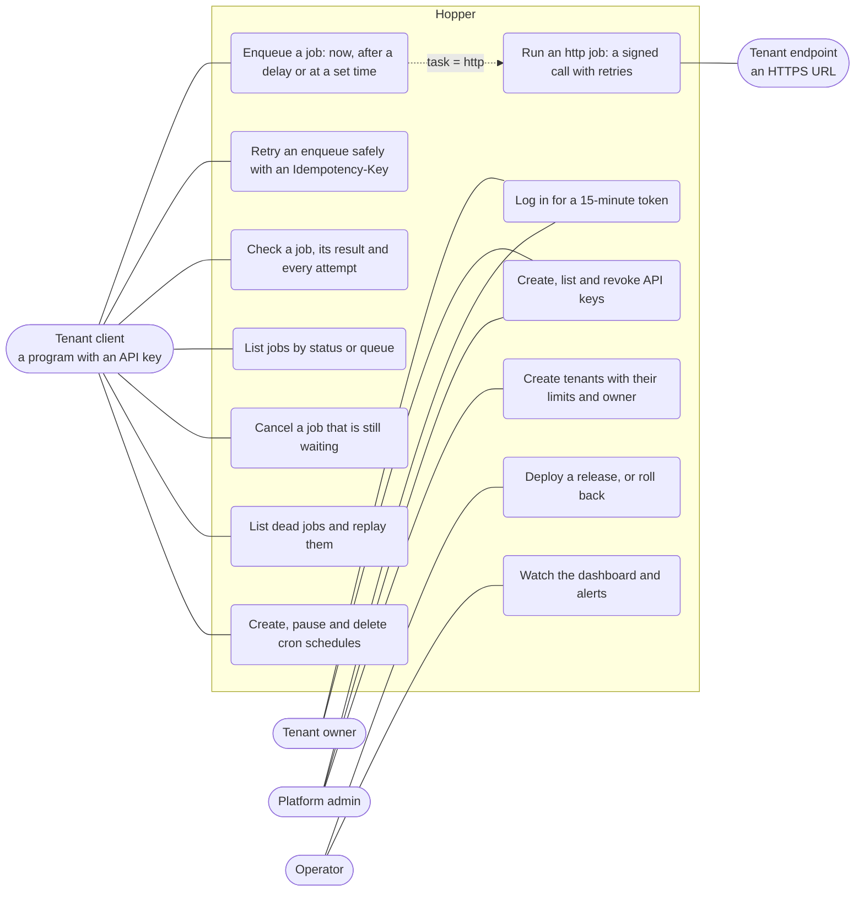

## 2. Components

One image runs every role. Caddy is the only public entry. The API, workers and schedulers keep no state of their
own: PostgreSQL holds every job, and Redis holds only rate-limit buckets and a cached queue depth.

<!-- diagram: components -->
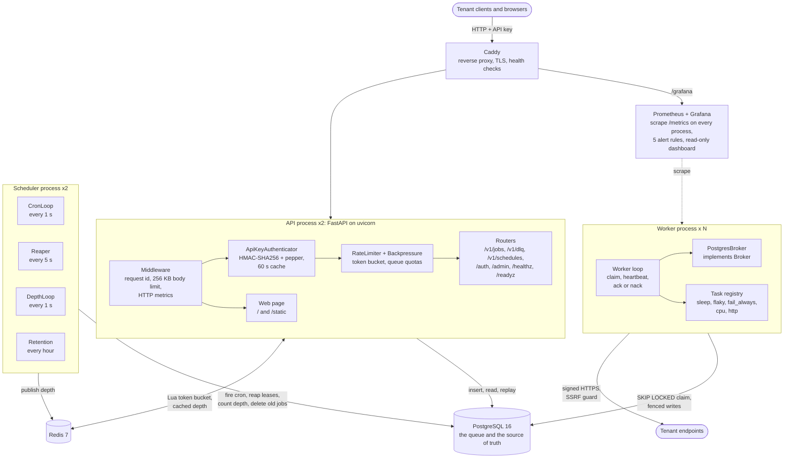

## 3. Deployment

A merge to `main` runs CI, pushes an image to GHCR, and asks the EC2 host to deploy it over SSH with a key that can
only run `deploy.sh`. Only Caddy has public ports.

<!-- diagram: deployment -->
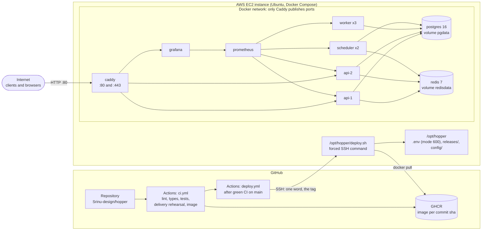

## 4. Classes

The worker depends only on the `Broker` interface, so the same `Worker` runs on PostgreSQL in production and on the
broker written from scratch (the stretch goal).

<!-- diagram: classes -->
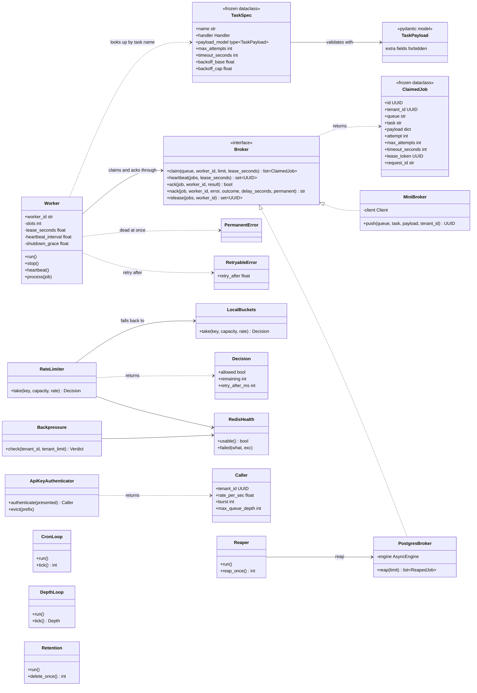

## 5. Database

Six tables hold everything; two more exist only for the chaos test. A job is one row in `jobs`, and every change
to it is one guarded `UPDATE`. A dead job is a row with `status = 'dead'`, not a row in another table, so it keeps
its id and history (ADR-0005).

<!-- diagram: database -->
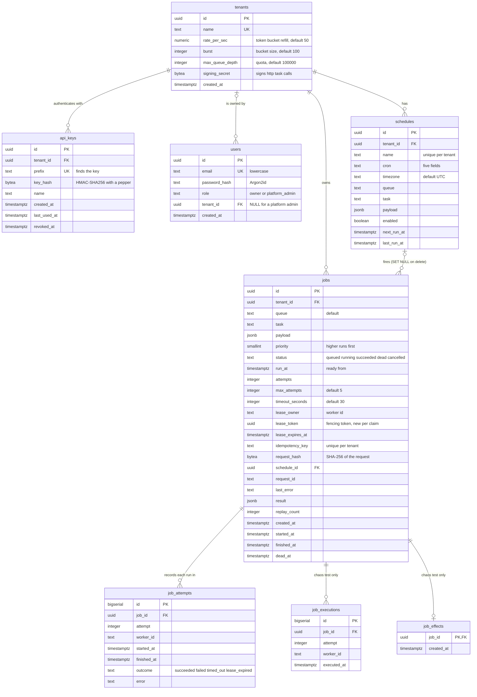

Indexes, each partial where it can be, so it stays small as finished jobs pile up:

| Index | On | Serves |
|---|---|---|
| `jobs_ready_idx` | `(queue, priority DESC, run_at) WHERE status = 'queued'` | the claim query |
| `jobs_lease_idx` | `(lease_expires_at) WHERE status = 'running'` | the reaper |
| `jobs_dead_idx` | `(tenant_id, queue, dead_at DESC) WHERE status = 'dead'` | listing the DLQ |
| `jobs_tenant_idx` | `(tenant_id, created_at DESC)` | listing a tenant's jobs |
| `jobs_idem_uidx` | unique `(tenant_id, idempotency_key) WHERE idempotency_key IS NOT NULL` | idempotency keys |
| `jobs_schedule_idx` | `(schedule_id) WHERE schedule_id IS NOT NULL` | deleting a schedule |
| `schedules_due_idx` | `(next_run_at) WHERE enabled` | the cron loop |
| `job_attempts_job_idx`, `api_keys_tenant_idx` | `(job_id)`, `(tenant_id)` | a job's history, a tenant's keys |

`jobs` is vacuumed after 2% of its rows change instead of the default 20%, because the queue updates rows all the
time. Finished jobs are deleted after 7 days.

## 6. Job states

<!-- diagram: job-states -->
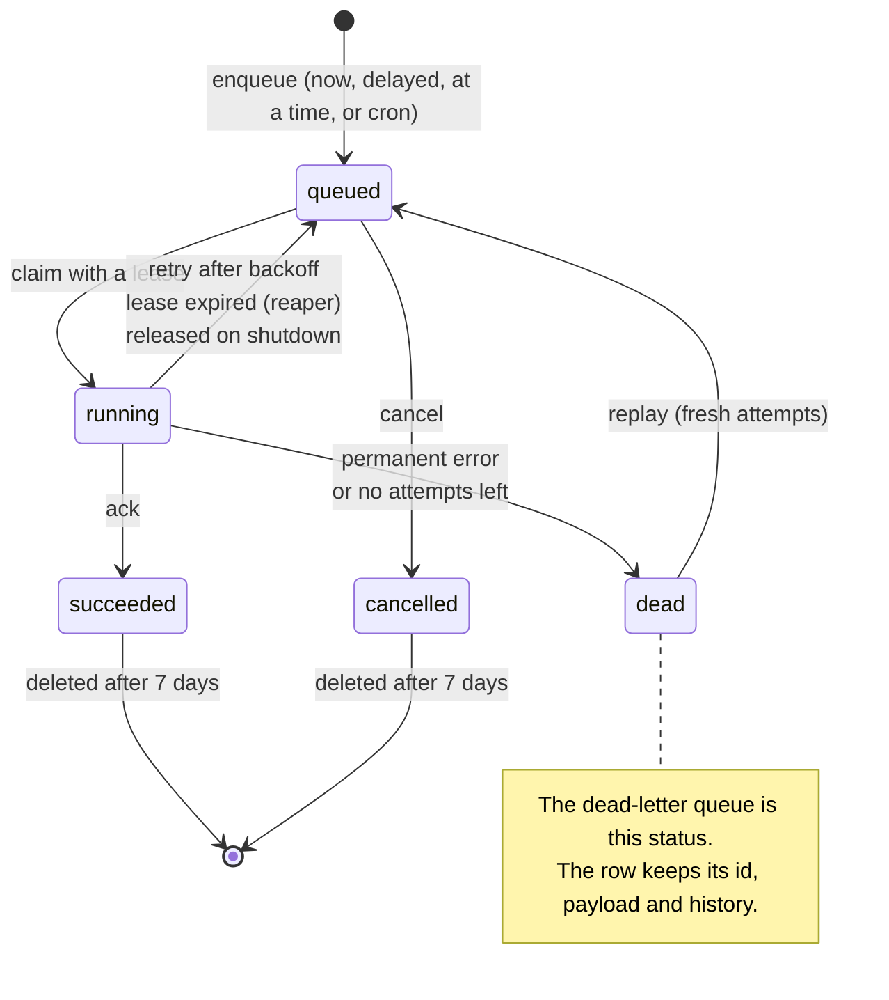

While a job is `running`, its worker renews the lease every 10 s (the heartbeat); the job stays `running`.

## 7. Enqueue a job

<!-- diagram: seq-enqueue -->
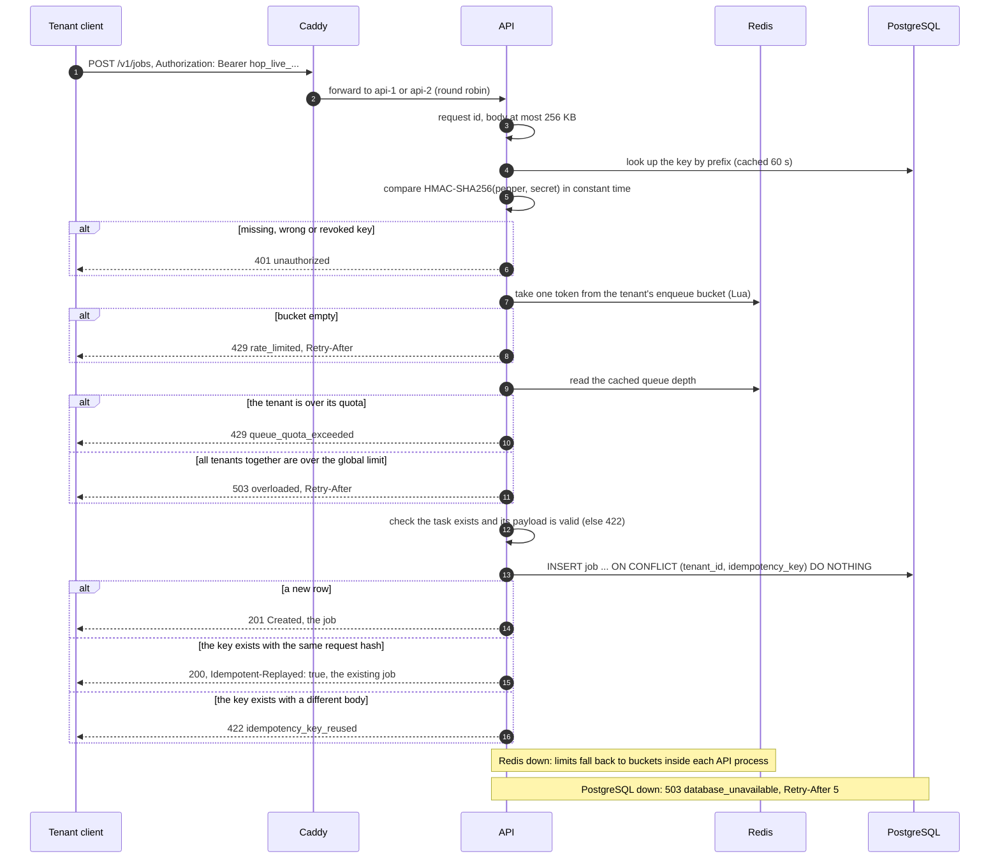

## 8. Run a job

<!-- diagram: seq-run -->
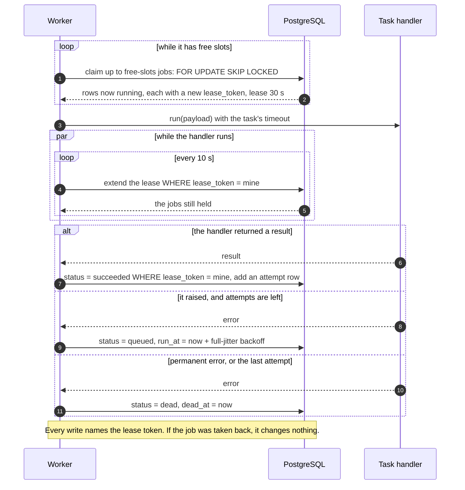

## 9. A worker dies

At-least-once in one picture: the job runs again on another worker, and the first worker's late answer is
refused because its token is stale.

<!-- diagram: seq-crash -->
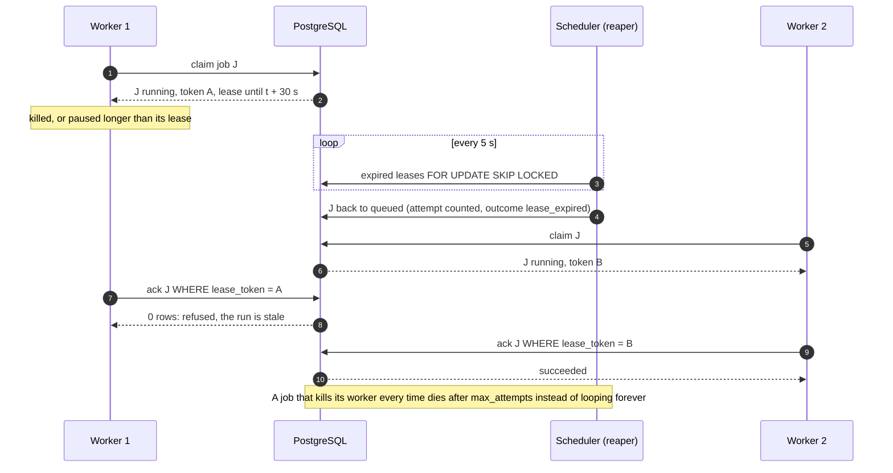

## 10. Cron with two schedulers

<!-- diagram: seq-cron -->
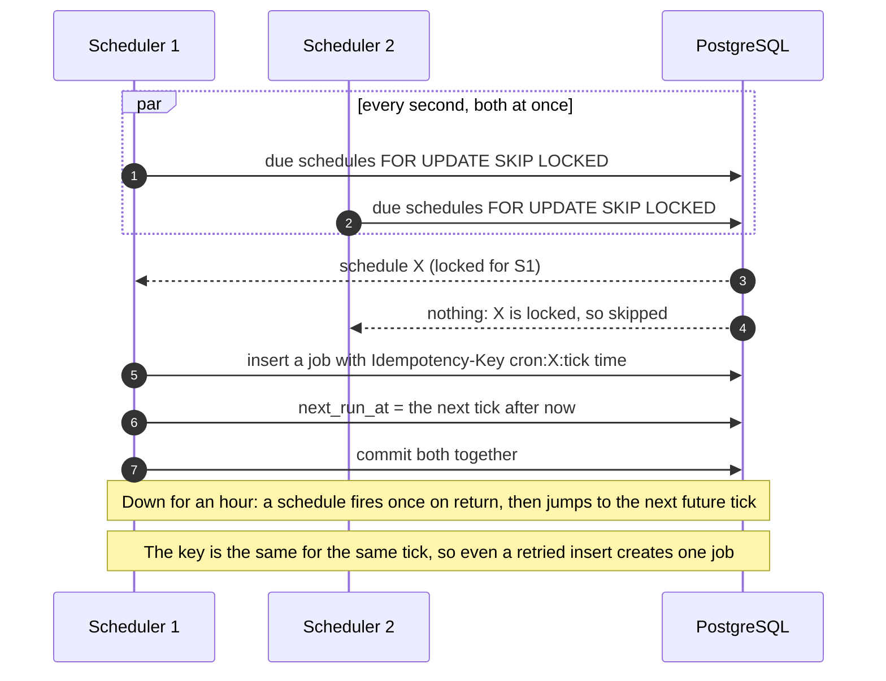

## 11. When a run fails

<!-- diagram: failure-activity -->
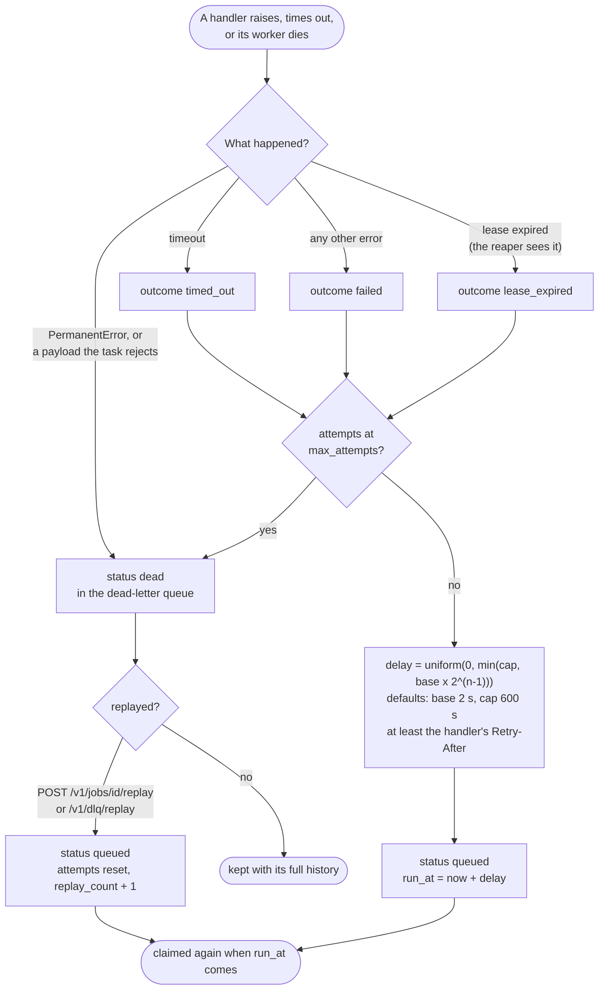

## 12. Deploy and roll back

<!-- diagram: seq-deploy -->
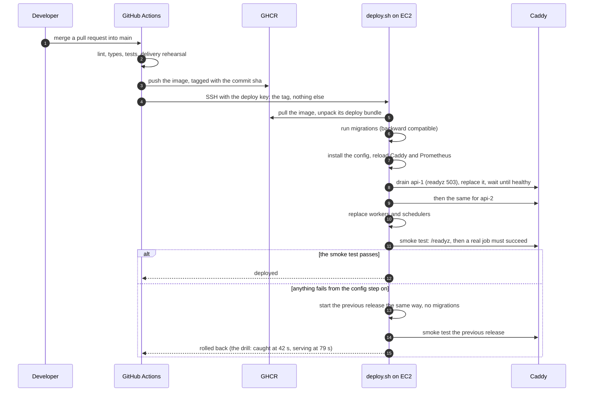
